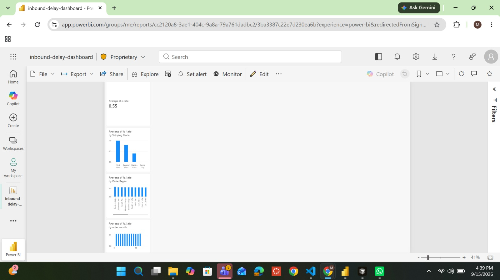

# Inbound Logistics Delay Root-Cause & Agentic Reporting System

> Status: ✅ Complete — full pipeline from data cleaning through a live dashboard and AI-generated reports

## Problem
Inbound shipment delays are costly and hard to diagnose after the fact. Planning teams currently review delays manually, which is slow and doesn't scale as shipment volume grows. This project analyzes historical shipment data to identify the top drivers of delay and predicts delay risk before shipment, so planners can intervene early instead of reacting after a shipment is already late.

## Dashboard
**[🔗 View the live interactive dashboard](https://inbound-delay-agentic-reporting-maneeshraja.streamlit.app/)**

*(Built with Streamlit and deployed on Streamlit Community Cloud. A Power BI version is also included in this repo under `dashboard/` for anyone who wants to open it directly in Power BI Desktop.)*



## Approach
1. Cleaned and joined DataCo shipment data, converting text dates to real datetime types and defining a validated `is_late` target variable (~95% agreement with the dataset's own built-in label)
2. Identified top delay drivers through exploratory analysis across shipping mode, region, and month
3. Built a time-split delay-risk classifier (Logistic Regression → XGBoost), evaluated on PR-AUC, with leak-free features only
4. Built a live, interactive dashboard (Streamlit, deployed publicly; Power BI version also included)
5. Built an AI agent that turns pre-computed weekly stats into a written report — it summarizes numbers, it does not calculate them

## Key findings
- **Shipping mode is the strongest driver of delay.** First Class is late 100% of the time and Second Class ~80% of the time — not due to poor execution, but because the promised delivery window itself is unrealistic (e.g., First Class promises 1 day but actually takes ~2 days on average). Standard Class's promise roughly matches reality (~4 promised vs ~4 actual), making it the most honestly-scheduled option.
- **Region is a weak driver.** Late rates range narrowly from ~51% to ~59% across all order regions — no single region stands out as a major outlier.
- **Month/seasonality is a weak, inconclusive driver.** Late rates stay within a tight ~54.1%–55.5% band across the year, with a mild uptick toward year-end that isn't strong enough to confirm as a real seasonal effect.
- **The prediction model independently confirmed this.** XGBoost's feature importance chart shows `Days for shipment (scheduled)` overwhelmingly dominates all other features — the model "discovered" the same root cause found through manual analysis, without being told what to look for.
- **Overall takeaway:** the delivery *promise* itself — not geography or season — is the primary lever for reducing late-delivery rates in this dataset.

## Model performance
- Logistic Regression baseline: **PR-AUC 0.842**
- XGBoost: **PR-AUC 0.843** (essentially tied — the added model complexity wasn't needed, since one dominant, near-linear feature explains most of the signal)
- Evaluated with a time-based 80/20 train/test split (train on older shipments, test on newer ones) to avoid data leakage

## Repo structure
```
app.py        # live Streamlit dashboard
data/         # not committed (except dashboard_data.csv) — see "Getting the data" below
notebooks/    # exploratory analysis, model development
src/          # reusable cleaning/modeling/reporting scripts
dashboard/    # Power BI (.pbix) dashboard and screenshots
docs/         # design.md, decisions log
reports/      # example AI-generated weekly reports
```


## Getting the data
1. Download the DataCo Smart Supply Chain dataset from Kaggle: [DataCo Smart Supply Chain for Big Data Analysis](https://www.kaggle.com/datasets/shashwatwork/dataco-smart-supply-chain-for-big-data-analysis)
2. Place the CSV in `data/`
3. Run `notebooks/01_first_look.ipynb` to reproduce the cleaned dataset and analysis
4. Run `notebooks/02_model.ipynb` to reproduce the prediction model

## Setup
```bash
python -m venv venv
source venv/bin/activate      # Windows: venv\Scripts\activate
pip install -r requirements.txt
cp .env.example .env          # then add your Gemini API key
python src/generate_report.py # generates an AI weekly report
```

## Design decisions
See `docs/design.md` for the full design doc and `DECISIONS.md` for a running log of trade-offs made along the way — including why certain features were dropped, why Gemini was chosen over Anthropic's paid API, and how a `.gitignore` bug was diagnosed and fixed during Streamlit deployment.

## Resume bullet
Built and deployed an end-to-end shipment delay analysis system: cleaned and validated 180K+ real shipment records, identified delivery-promise scheduling as the primary root cause of lateness (confirmed independently by both manual analysis and model feature importance), trained a delay-risk classifier (XGBoost, PR-AUC 0.843), and shipped a live interactive dashboard plus an AI agent that auto-generates weekly plain-English ops reports from computed statistics.